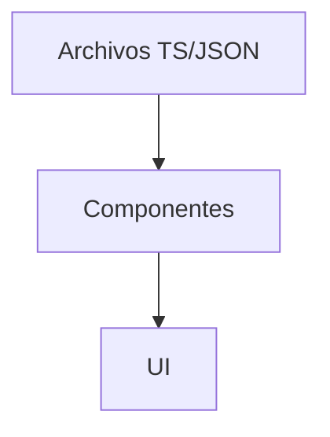
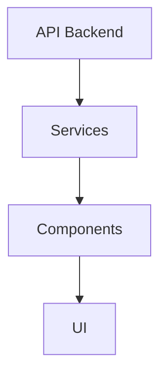

# Arquitectura de la Aplicación

## 🎯 Objetivos de Diseño
- Separación clara entre UI y datos
- Componentes reutilizables
- Fácil mantenimiento y escalabilidad
- Tipado fuerte con TypeScript

## 📱 Componentes Principales

### Solutions
Los componentes de soluciones manejan casos específicos de atención:

```typescript
// Ejemplo de estructura de una solución
interface Solution {
  id: string;
  type: SolutionType;
  sections: Section[];
}
```

### Sections
Componentes reutilizables para mostrar diferentes tipos de información:

- `ScriptSection`: Muestra guiones de atención
- `BenefitsSection`: Muestra beneficios de planes
- `RatesSection`: Muestra tarifas y planes
- `FAQSection`: Muestra preguntas frecuentes

## 🔄 Flujo de Datos

### Actual (Local)


### Futuro (Backend)


3. Documentación de servicios (para la futura integración con backend):

```markdown:docs/SERVICES.md
# Servicios de la Aplicación

## 🌐 API Services

### ScriptService
```typescript
interface ScriptService {
  getScriptByType(type: SolutionType): Promise<Script>;
  getAllScripts(): Promise<Script[]>;
}
```

### RatesService
```typescript
interface RatesService {
  getRatesByPlan(planType: PlanType): Promise<Rate[]>;
  getCurrentPromotions(): Promise<Promotion[]>;
}
```

## 🔐 Autenticación
Por implementar - Integración con sistema de autenticación de Claro
```

4. Documentación de tipos:

```markdown:docs/TYPES.md
# Tipos y Interfaces

## 📝 Modelos de Datos

### Script
```typescript
interface Script {
  id: string;
  title: string;
  lines: ScriptLine[];
}

interface ScriptLine {
  text: string;
  type: 'empathy' | 'solution' | 'benefit' | 'closing';
}
```

### Rate
```typescript
interface Rate {
  id: string;
  planName: string;
  price: number;
  features: string[];
  isPromotional: boolean;
}
```
```

5. Agregar documentación en los componentes:

```typescript:src/components/solutions/sections/ScriptSection.tsx
/**
 * @component ScriptSection
 * @description Componente que renderiza un guión de atención estructurado
 * 
 * @example
 * ```tsx
 * <ScriptSection
 *   title="Guión de Retención"
 *   lines={[
 *     { text: "Entiendo su preocupación", type: "empathy" },
 *     { text: "Podemos ofrecerle...", type: "solution" }
 *   ]}
 * />
 * ```
 */
interface ScriptSectionProps {
  /** Título del guión */
  title: string;
  /** Array de líneas del guión */
  lines: ScriptLine[];
}
```

6. Crear un archivo de configuración para constantes:

```typescript:src/config/constants.ts
/**
 * @constant SOLUTION_TYPES
 * @description Tipos de soluciones disponibles en la aplicación
 */
export const SOLUTION_TYPES = {
  HOGAR_COSTOS: 'hogar_costos',
  INTERNET_LENTO: 'internet_lento',
  // ... más tipos
} as const;

/**
 * @constant API_ENDPOINTS
 * @description Endpoints de la API (para futura implementación)
 */
export const API_ENDPOINTS = {
  SCRIPTS: '/api/scripts',
  RATES: '/api/rates',
  // ... más endpoints
} as const;
```

7. Crear un archivo de convenciones para el equipo:

```markdown:docs/CONVENTIONS.md
# Convenciones de Código

## 📝 Nombrado
- Componentes: PascalCase (ej: `ScriptSection`)
- Funciones: camelCase (ej: `getFeaturedRates`)
- Constantes: SNAKE_CASE (ej: `MAX_RETRY_ATTEMPTS`)

## 🎨 Estilos
- Usar variables SCSS para colores y medidas
- BEM para nombrado de clases CSS
- Mobile-first en media queries

## 🔄 Git
- Commits: usar prefijos (feat:, fix:, docs:, etc.)
- Branches: feature/, hotfix/, release/
```

Esta estructura de documentación:
1. Facilita el onboarding de nuevos desarrolladores
2. Mantiene el código mantenible y escalable
3. Proporciona una referencia clara para futuras implementaciones
4. Ayuda a mantener consistencia en el código
5. Facilita la transición a una arquitectura con backend

¿Te gustaría que profundicemos en alguna parte específica de la documentación o que agreguemos alguna sección adicional? 